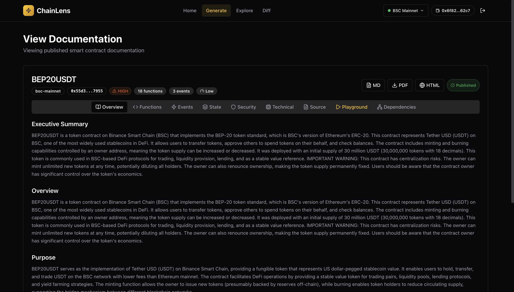
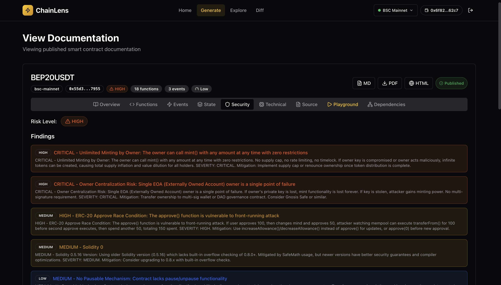
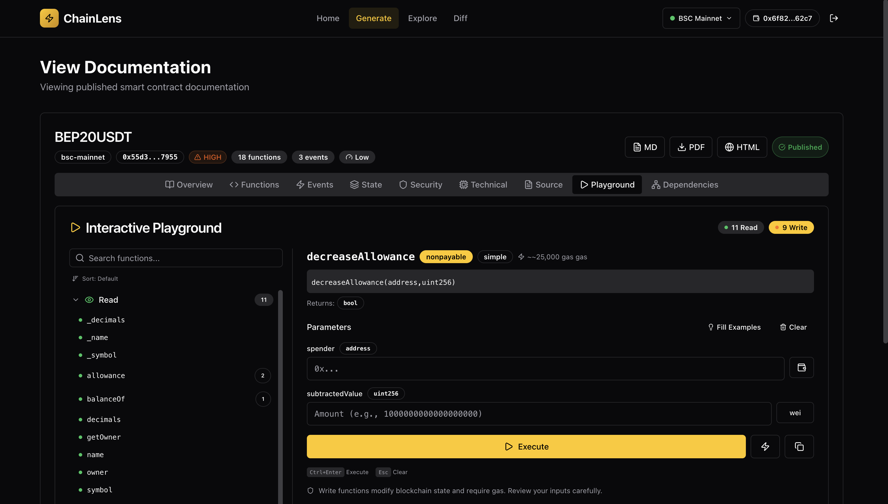

# ChainLens

[](https://bscscan.com/address/0x94e7DAaeB4d28fF2e71912fd06818b41009de47e)
[](https://repo.sourcify.dev/contracts/full_match/56/0x94e7DAaeB4d28fF2e71912fd06818b41009de47e/)
[](LICENSE)

**Understand any smart contract in seconds.** Generate comprehensive documentation, security analysis, and interactive playgrounds — powered by Claude AI. Built for BNB Chain.

## Features

- **AI Documentation Generation** — Generate comprehensive docs from any verified BSC contract using Claude AI, with streaming progress feedback
- **Interactive Contract Playground** — Auto-generated UI for reading and writing contract functions directly in the browser (no code required)
- **On-Chain Registry** — Documentation is stored on IPFS and registered on-chain via the DocRegistry smart contract, enabling permanent, verifiable docs
- **Smart Caching** — Automatically checks the on-chain registry before generating, loading existing docs from IPFS in seconds
- **Contract Version Diffing** — AST-based comparison between contract versions with breaking change detection
- **Dependency Graph Visualization** — Interactive cross-contract dependency mapping using React Flow
- **Security Analysis** — AI-powered vulnerability detection, access control review, and recommendations
- **Multi-Format Export** — Download documentation as Markdown, PDF, or HTML
- **Multi-Network Support** — BSC Mainnet, BSC Testnet, and opBNB

### Generated Documentation


### Security Analysis


### Playground


## Tech Stack

| Layer | Technology |
|-------|-----------|
| Frontend | Next.js 14 (App Router), TypeScript, Tailwind CSS, Shadcn UI |
| AI | Claude API (`@anthropic-ai/sdk`) |
| Web3 | ethers.js v6, MetaMask |
| Parsing | `@solidity-parser/parser` (AST) |
| Visualization | React Flow, D3.js, Recharts |
| Code Editor | Monaco Editor |
| Storage | Pinata (IPFS), DocRegistry (on-chain) |
| Smart Contracts | Hardhat, Solidity 0.8.24, OpenZeppelin |

## Quick Start

### Prerequisites

- Node.js 18+
- npm or yarn
- MetaMask browser extension
- **Test Tokens** BNB Testnet faucet tokens ([faucet.bnbchain.org](https://www.bnbchain.org/en/testnet-faucet))
- **API Keys:**
  - [Anthropic API key](https://console.anthropic.com/) — for Claude AI documentation generation
  - [BSCScan API key](https://bscscan.com/apis) — for fetching verified contract source code
  - [Pinata JWT](https://app.pinata.cloud/) — for IPFS uploads (optional, only needed for publishing)

### Installation

```bash
# Clone the repository
git clone https://github.com/Giftea/chainlens.git
cd chainlens

# Install dependencies
npm install

# Copy environment variables
cp .env.example .env

# Fill in your API keys in .env (see table below)
```

### Environment Variables

| Variable | Description | Required |
|----------|------------|----------|
| `ANTHROPIC_API_KEY` | Claude AI API key | Yes |
| `NEXT_PUBLIC_BSCSCAN_API_KEY` | BSCScan API key | Yes |
| `NEXT_PUBLIC_PINATA_JWT` | Pinata IPFS JWT token | For publishing |
| `NEXT_PUBLIC_CONTRACT_ADDRESS_MAINNET` | DocRegistry on BSC Mainnet (`0x94e7DAaeB4d28fF2e71912fd06818b41009de47e`) | For on-chain features |
| `NEXT_PUBLIC_CONTRACT_ADDRESS_TESTNET` | DocRegistry on BSC Testnet (`0x94e7DAaeB4d28fF2e71912fd06818b41009de47e`) | For on-chain features |
| `BSC_PRIVATE_KEY` | Deployer wallet private key | For contract deployment |
| `BSC_RPC_URL` | BSC RPC url (`https://bsc-dataseed1.ninicoin.io/`) | BSC RPC endpoint |

### Development

```bash
# Start development server
npm run dev

# Open http://localhost:3000
```

### Smart Contracts

The DocRegistry contract manages on-chain documentation records. It stores metadata (contract address, IPFS hash, version, function count, etc.) and supports pagination, versioning, and ownership.

**Deployed Contracts:**

| Network | Address |
|---------|---------|
| BSC Mainnet | [`0x94e7DAaeB4d28fF2e71912fd06818b41009de47e`](https://bscscan.com/address/0x94e7DAaeB4d28fF2e71912fd06818b41009de47e) |
| BSC Testnet | [`0x94e7DAaeB4d28fF2e71912fd06818b41009de47e`](https://testnet.bscscan.com/address/0x94e7DAaeB4d28fF2e71912fd06818b41009de47e) |

```bash
# Compile contracts
npx hardhat compile

# Run tests
npx hardhat test

# Deploy to BSC Testnet
npx hardhat run src/contracts/deploy.ts --network bscTestnet

# Deploy to BSC Mainnet
npx hardhat run src/contracts/deploy.ts --network bscMainnet

# Verify on BSCScan
npx hardhat verify --network bscMainnet <DEPLOYED_ADDRESS>
```

### Production Build

```bash
npm run build
npm start
```

## Project Structure

```
chainlens/
├── src/
│   ├── app/                    # Next.js App Router pages
│   │   ├── page.tsx            # Landing page
│   │   ├── generate/           # Documentation generator
│   │   ├── explore/            # Contract explorer & playground
│   │   ├── diff/               # Version diffing
│   │   └── api/                # API routes
│   │       ├── generate/       # AI documentation generation (SSE streaming)
│   │       ├── fetch-contract/ # Fetch source from BSCScan
│   │       ├── analyze-abi/    # ABI analysis for playground
│   │       ├── build-graph/    # Dependency graph construction
│   │       ├── diff/           # Contract comparison
│   │       ├── export/         # Documentation export (MD/PDF/HTML)
│   │       ├── upload-ipfs/    # IPFS upload via Pinata
│   │       └── get-all-docs/   # Fetch all on-chain documentation
│   ├── components/             # React components
│   │   ├── ui/                 # Shadcn UI components
│   │   ├── playground/         # Interactive playground components
│   │   │   └── inputs/         # Type-aware input components
│   │   ├── DocGenerator.tsx    # Main doc generation form
│   │   ├── DocViewer.tsx       # Documentation viewer with tabs
│   │   ├── ContractPlayground.tsx  # Interactive contract UI
│   │   ├── DiffViewer.tsx      # Contract diff viewer
│   │   ├── DependencyGraph.tsx # React Flow dependency graph
│   │   └── WalletConnect.tsx   # MetaMask wallet connection
│   ├── lib/                    # Core logic
│   │   ├── contractFetcher.ts  # BSCScan API integration
│   │   ├── documentationGenerator.ts  # Claude AI integration
│   │   ├── astParser.ts        # Solidity AST parsing
│   │   ├── abiAnalyzer.ts      # ABI analysis for playground
│   │   ├── diffEngine.ts       # AST-based contract diffing
│   │   ├── dependencyMapper.ts # Dependency graph builder
│   │   ├── ipfsUploader.ts     # Pinata IPFS integration
│   │   ├── web3Client.ts       # ethers.js setup
│   │   └── exporters/          # MD, PDF, HTML exporters
│   ├── contracts/              # Solidity smart contracts
│   │   ├── DocRegistry.sol     # On-chain documentation registry
│   │   ├── deploy.ts           # Deployment script
│   │   └── test/               # Contract tests
│   ├── types/                  # TypeScript type definitions
│   └── config/                 # Network & chain configurations
├── hardhat.config.ts
├── tailwind.config.ts
├── next.config.mjs
└── package.json
```

## How It Works

1. **Enter a contract address** — Paste any verified BSC/opBNB contract address
2. **Registry check** — ChainLens first checks the on-chain DocRegistry for existing documentation
3. **If cached** — Loads docs instantly from IPFS (no AI call needed)
4. **If new** — Fetches source code from BSCScan, parses the AST, and generates documentation via Claude AI with streaming progress
5. **View & interact** — Browse docs, test functions in the playground, view dependency graphs, and compare versions
6. **Publish** — Upload to IPFS and register on-chain so others can discover and reuse the docs

## API Routes

| Endpoint | Method | Description |
|----------|--------|-------------|
| `/api/generate` | POST | Generate AI documentation (SSE streaming) |
| `/api/fetch-contract` | POST | Fetch contract source from BSCScan |
| `/api/analyze-abi` | POST | Analyze ABI for playground generation |
| `/api/build-graph` | POST | Build dependency graph from source |
| `/api/diff` | POST | Compare two contract versions |
| `/api/export` | POST | Export documentation (MD/PDF/HTML) |
| `/api/upload-ipfs` | POST | Upload documentation bundle to IPFS |
| `/api/get-all-docs` | POST | Fetch all published docs from on-chain registry |


## 🏆 Hackathon Info
- Built for: BNB Chain Good Vibes Only: OpenClaw Edition
- Track: Builders (Developer Tools)
- Team: Giftea - Solo Developer
- AI Usage: ~85% (Claude for code generation + analysis)

## Why ChainLens Wins:
- ✅ Solves Real Problem - Undocumented contracts hurt entire ecosystem
- ✅ Heavy AI Usage - Claude is core to product (not just helper)
- ✅ Unique Features - Interactive playground NO ONE else has
- ✅ Production-Ready - Deployed, tested, fully functional
- ✅ BNB Chain Native - Built specifically for BSC ecosystem
- ✅ Onchain Proof - Verifiable documentation registry
- ✅ Open Source - Community can build on it

## License

MIT
