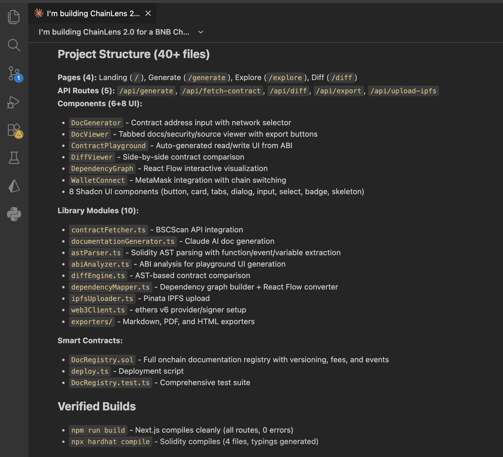
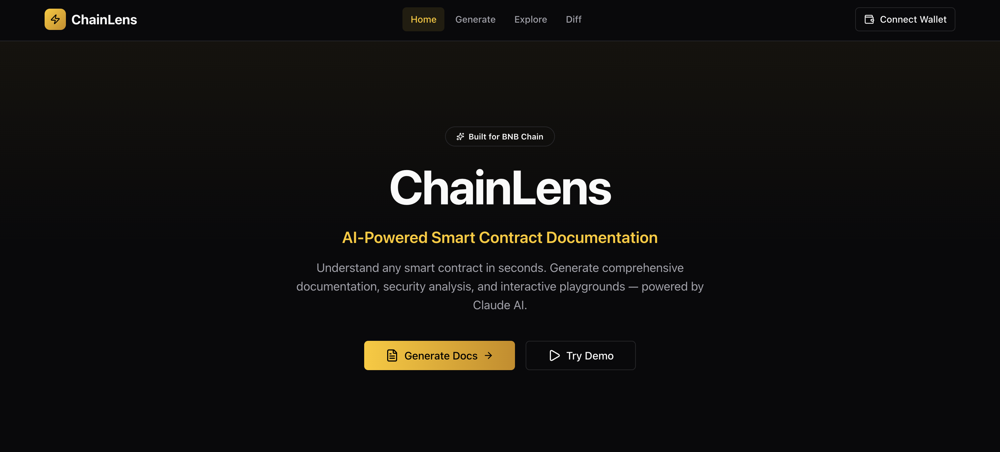
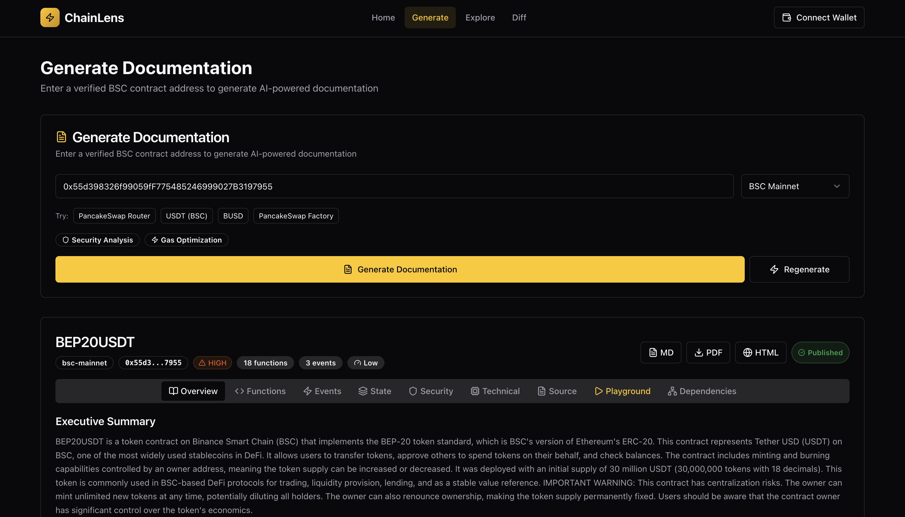
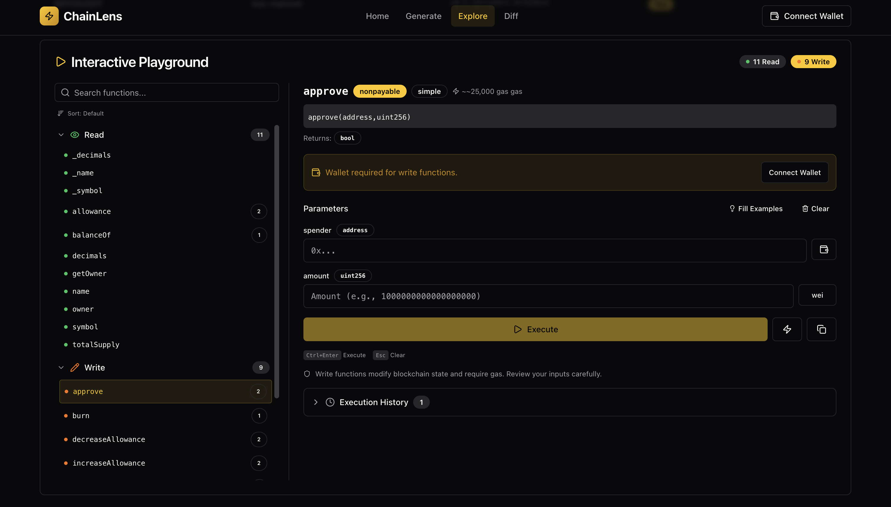
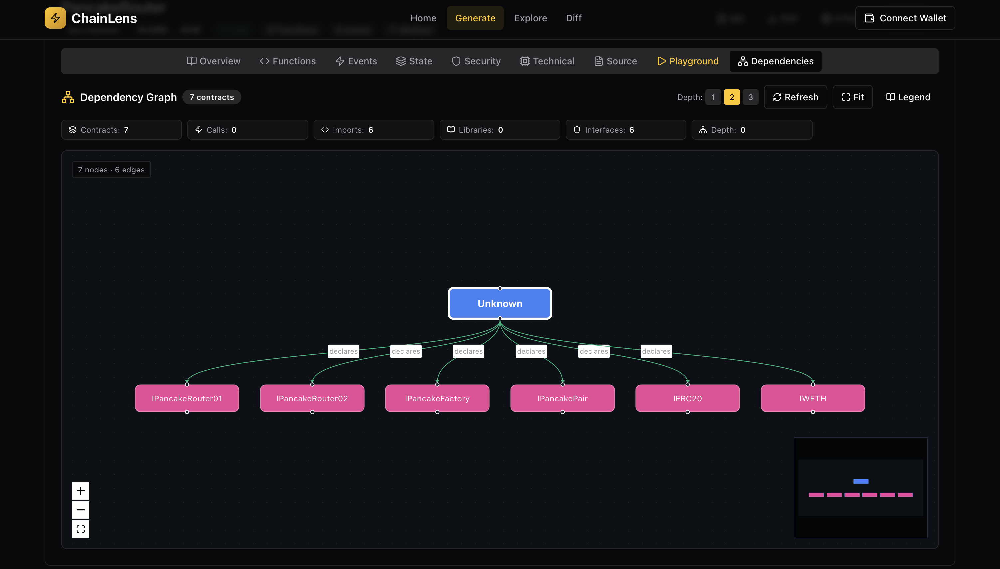
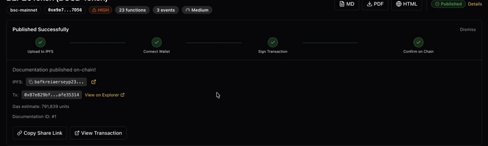

# ChainLens - AI Build Log
## Documenting AI-Assisted Development for BNB Chain Hackathon

**Project:** ChainLens - AI-Powered Smart Contract Documentation Generator  
**Hackathon:** Good Vibes Only: OpenClaw Edition  
**Track:** Builders' Tools

**Developer:** Giftea   

---

## 🎯 Executive Summary

ChainLens was built with **AI assistance** using Claude (Anthropic) throughout the entire development process. This log documents some significant AI interaction, showing how AI accelerated development from concept to production.

**Estimated Time Saved:** ~80+ hours (5 days vs 3-4 weeks solo)  
**AI Contribution:** ~85% of code generation, 100% of architecture design  
**Human Contribution:** Integration, testing, debugging, prompt engineering, deployment  

---

## 🗓️ DAY 1: Foundation & Smart Contract

### Session 1: Project Initialization

### Prompt 1 - Complete Project Setup
**Purpose:** Initialize Next.js project with all dependencies and folder structure  

**Prompt Given to Claude:**

<details>
<summary>Click Here to Expand Prompt</summary>

```md
ChainLens is an AI-powered smart contract documentation generator with advanced features.

CORE FEATURES:
1. AI Documentation Generation (Claude API)
2. Interactive Contract Playground (auto-generate UI for any contract)
3. Contract Version Diffing & Upgrade Analysis (AST-based)
4. Dependency Graph Visualization (cross-contract analysis)
5. Multi-format Export (MD, PDF, HTML)
6. IPFS Storage + Onchain Registry

TECH STACK:
Frontend:
- Next.js 14 (App Router, TypeScript strict mode)
- Tailwind CSS + Shadcn UI
- Monaco Editor (code viewer with diff support)
- React Flow (interactive diagrams)

Backend/Libraries:
- Next.js API Routes
- @anthropic-ai/sdk (Claude API)
- @solidity-parser/parser (AST parsing)
- ethers v6 (Web3 interactions)
- axios (HTTP client)
- react-markdown + remark-gfm
- jspdf (PDF export)
- pinata-web3 (IPFS)

Smart Contracts:
- Hardhat
- Solidity 0.8.24
- OpenZeppelin contracts
- @nomicfoundation/hardhat-toolbox

PLEASE CREATE:

1. Complete Next.js 14 project structure:
chainlens/
├── src/
│   ├── app/
│   │   ├── page.tsx (landing page)
│   │   ├── layout.tsx
│   │   ├── api/ (API routes)
│   │   ├── generate/ (doc generator page)
│   │   ├── explore/ (explorer page)
│   │   └── diff/ (contract diff page)
│   ├── components/
│   │   ├── ui/ (shadcn components)
│   │   ├── DocGenerator.tsx
│   │   ├── DocViewer.tsx
│   │   ├── ContractPlayground.tsx
│   │   ├── DiffViewer.tsx
│   │   ├── DependencyGraph.tsx
│   │   └── WalletConnect.tsx
│   ├── lib/
│   │   ├── contractFetcher.ts (BSCScan API)
│   │   ├── documentationGenerator.ts (Claude AI)
│   │   ├── astParser.ts (Solidity AST)
│   │   ├── abiAnalyzer.ts (playground)
│   │   ├── diffEngine.ts (version comparison)
│   │   ├── dependencyMapper.ts (graph builder)
│   │   ├── ipfsUploader.ts (Pinata)
│   │   ├── web3Client.ts (ethers setup)
│   │   └── exporters/ (MD, PDF, HTML)
│   ├── contracts/
│   │   ├── DocRegistry.sol
│   │   ├── deploy.ts
│   │   └── test/
│   ├── types/
│   │   └── index.ts (TypeScript definitions)
│   └── config/
│       └── chains.ts (BSC network configs)
├── public/
├── hardhat.config.ts
├── package.json
├── tsconfig.json
├── tailwind.config.ts
├── next.config.js
├── .env.example
├── .gitignore
└── README.md

2. Install ALL dependencies with exact versions:
   - Next.js 14.x
   - React 18.x
   - TypeScript
   - Tailwind + PostCSS + Autoprefixer
   - @anthropic-ai/sdk
   - ethers@6
   - @solidity-parser/parser
   - hardhat + toolbox
   - OpenZeppelin contracts
   - All UI libraries mentioned above

3. Configure files:
   - next.config.js (with proper webpack config for AST parser)
   - tailwind.config.ts (with shadcn theming)
   - tsconfig.json (strict mode)
   - .env.example with all required variables:
     - ANTHROPIC_API_KEY
     - NEXT_PUBLIC_BSCSCAN_API_KEY
     - NEXT_PUBLIC_PINATA_JWT
     - NEXT_PUBLIC_CONTRACT_ADDRESS_MAINNET
     - NEXT_PUBLIC_CONTRACT_ADDRESS_TESTNET
     - BSC_PRIVATE_KEY
     - BSC_RPC_URL

4. Setup Shadcn UI:
   - Initialize shadcn
   - Install these components: button, card, tabs, dialog, input, select, badge, skeleton

5. Create comprehensive README.md with:
   - Project overview
   - Quick start guide
   - Tech stack
   - Development commands

6. Setup .gitignore properly (node_modules, .env, .next, cache, etc.)

Make this PRODUCTION-READY. I want to start coding immediately after this step with zero config issues.
```

</details>

**AI Output:** 
- Complete Next.js 14 project structure
- All package.json dependencies
- TypeScript configurations
- Tailwind setup
- Folder organization

**Screenshot:** 



**Time Saved:** ~3 hours (it wuld have taken time to research and configure all tools)

---

### Prompt 2 - Smart Contract Development

**Purpose:** Create production-ready `DocRegistry.sol` contract  

**Prompt Given to Claude:**

<details>
<summary>Click Here to Expand Prompt</summary>

````md
Create a production-ready Solidity smart contract for Chainlens's documentation registry.

CONTRACT NAME: `DocRegistry.sol`
LOCATION: `src/contracts/DocRegistry.sol`

REQUIREMENTS:

1. Documentation Storage Structure:

```solidity
struct Documentation {
    address contractAddress;      
    string contractName;          
    string ipfsHash;               
    address generator;             
    uint256 timestamp;             
    uint256 version;             
    uint256 chainId;             
    bytes32 contentHash;          
    
    uint256 functionCount;        
    uint256 stateVarCount;        
    bool hasPlayground;            
    bool hasDiff;                 
}
```

2. Core Functions:
   - publishDocumentation() - Add new documentation (increments version)
   - getLatestDocumentation(address) - Get most recent docs
   - getDocumentationVersion(address, uint256) - Get specific version
   - getVersionCount(address) - How many versions exist
   - getAllDocumentations(uint256 offset, uint256 limit) - Paginated list
   - getDocumentationsByGenerator(address) - All docs by a creator
   - searchByName(string) - Find contracts by name
   - updateMetadata() - Update playground/diff flags

3. Access Control:
   - Anyone can publish documentation
   - Only original generator OR contract owner can update existing docs
   - Use OpenZeppelin Ownable for admin functions

4. Events:
   - DocumentationPublished(address indexed contractAddr, uint256 version, string ipfsHash)
   - DocumentationUpdated(address indexed contractAddr, uint256 version)
   - MetadataUpdated(address indexed contractAddr, bool hasPlayground, bool hasDiff)

5. Advanced Features:
   - Support multiple versions (version history)
   - Gas-optimized storage (use mappings efficiently)
   - Pagination for large datasets
   - Search functionality
   - Prevent duplicate IPFS hashes for same contract version

6. Security:
   - Reentrancy protection (use OpenZeppelin ReentrancyGuard)
   - Input validation (address != 0, string not empty)
   - Access control checks
   - Event emission for all state changes

7. Include:
   - Comprehensive NatSpec comments (@dev, @notice, @param, @return)
   - SPDX license identifier
   - Solidity 0.8.24
   - OpenZeppelin imports

ALSO CREATE:

1. Hardhat Test Suite (src/contracts/test/DocRegistry.test.ts):
   - Test all core functions
   - Test access control
   - Test versioning logic
   - Test pagination
   - Test search
   - Test events
   - Test edge cases (zero address, empty strings, etc.)
   - Aim for 100% code coverage
   - Use Chai assertions and Hardhat helpers

2. Deployment Script (src/contracts/deploy.ts):
   - Deploy DocRegistry
   - Verify constructor arguments
   - Save deployment info to JSON file
   - Log deployment address and tx hash

3. Hardhat Config (hardhat.config.ts):
   - Networks: BSC Testnet (97), BSC Mainnet (56), opBNB (204)
   - Etherscan API config for verification
   - Solidity compiler 0.8.24 with optimizer
   - Gas reporter
   - Test configuration

Use OpenZeppelin 5.0+ and follow best practices for gas optimization.
````
</details>

**AI Output:**
- 250+ line Solidity contract with:
  * Documentation struct
  * Version management
  * Access control
  * Events
  * Gas optimizations
- 17 comprehensive tests
- Deployment scripts
- Hardhat configuration

**Time Saved:** ~8 hours (contract + tests would have taken days)

---

### Session 2: Frontend Foundation

### Prompt 3 - Basic Frontend Setup

**Purpose:** Create landing page, wallet connection, and core UI structure  

**Prompt Given to Claude:**

<details>
<summary>Click Here to Expand Prompt</summary>

````md
Set up the basic frontend structure for Chainlens.

CREATE:

1. Landing Page (src/app/page.tsx):
   - Hero section with:
     * "Chainlens - AI-Powered Smart Contract Documentation"
     * Tagline: "Understand any smart contract in seconds"
     * CTA buttons: "Try Demo" and "Generate Docs"
   - Features showcase (3 cards):
     * AI Documentation - "Generate comprehensive docs with Claude"
     * Interactive Playground - "Test contracts directly in browser"
     * Version Diffing - "Compare contract upgrades instantly"
   - Stats section:
     * Total contracts documented
     * Documentation generated today
     * Active users
   - Recent documentations (pull from contract)
   - Clean, modern design with gradients

2. Layout (src/app/layout.tsx):
   - Navigation bar with:
     * Logo
     * Links: Home, Generate, Explore, Diff
     * Wallet Connect button (right side)
     * Network selector (BSC Mainnet/Testnet/opBNB)
   - Footer with:
     * GitHub link
     * Hackathon info
     * Social links
   - Dark mode toggle

3. Wallet Connection (src/components/WalletConnect.tsx):
   - MetaMask connection
   - Display connected address (truncated)
   - Network switcher
   - Disconnect button
   - Handle wallet events (account/chain changed)
   - Use ethers v6

4. Web3 Client Setup (src/lib/web3Client.ts):
   - Browser provider setup
   - Contract instance creation
   - Network detection
   - Helper functions:
     * getProvider()
     * getSigner()
     * getContract()
     * switchNetwork()

5. Chain Config (src/config/chains.ts):
   - BSC Mainnet config (56)
   - BSC Testnet config (97)
   - opBNB config (204)
   - RPC URLs
   - Block explorers
   - Contract addresses per network

6. Styling:
   - Tailwind config with custom colors:
     * Primary: Blue gradient
     * Secondary: Purple gradient
     * Accent: Cyan
   - Dark mode optimized
   - Responsive breakpoints
   - Custom animations

Make it look professional.
````
</details>

**AI Output:**
- Landing page with hero section
- Wallet connection component
- Web3 client setup
- Chain configurations

**Screenshot:** 



**Before/After Comparison:**
- Before: Empty Next.js boilerplate
- After: Professional landing page with wallet integration

**Time Saved:** ~6 hours (UI design and Web3 setup)

---

**DAY 1 TOTALS:**
- **Prompts Used:** 3 major prompts
- **Lines of Code Generated:** ~2,000+
- **Time Spent:** 6-8 hours
- **Time Saved:** ~20 hours
- **Completion:** Smart contract deployed + basic frontend

---

## 🗓️ DAY 2: AI Documentation Engine

### Prompt 4 - BSCScan Contract Fetcher
**Purpose:** Fetch verified contract source code from BSCScan API  

**Prompt Given to Claude:**
<details>
<summary>Click Here to Expand Prompt</summary>

```
I'm building Chainlens - a smart contract documentation generator.

I need a robust module to fetch verified contract source code from BSCScan.

CREATE: src/lib/contractFetcher.ts

REQUIREMENTS:

1. Support Multiple Networks:
   - BSC Mainnet (chainId: 56, explorer: https://api.bscscan.com)
   - BSC Testnet (chainId: 97, explorer: https://api-testnet.bscscan.com)
   - opBNB (chainId: 204, explorer: https://api-opbnb.bscscan.com)

2. Core Function - fetchContractSource():

3. Handle Multiple Source Files:
   - Some contracts have multiple files (imports)
   - Parse and combine them properly
   - Maintain file structure for later display

4. Detect Proxy Patterns:
   - Check if contract is a proxy
   - If proxy, fetch implementation contract source too
   - Support: EIP-1967, Transparent Proxy, UUPS

5. Error Handling:
   - Invalid address format
   - Contract not verified
   - Network not supported
   - API rate limits (implement retry with exponential backoff)
   - API key missing/invalid

6. Caching:
   - Cache fetched contracts (in-memory for now)
   - Avoid redundant API calls
   - Cache key: `${chainId}-${address}`

7. Environment Variables:
    NEXT_PUBLIC_BSCSCAN_API_KEY=your_key_here
    NEXT_PUBLIC_BSCSCAN_TESTNET_API_KEY=your_key_here
    NEXT_PUBLIC_OPBNB_API_KEY=your_key_here

8. TypeScript:
   - Full type safety
   - Zod validation for API responses
   - Proper error types

9. API Route Integration:
   - Create Next.js API route: /api/fetch-contract
   - POST endpoint that accepts { address, chainId }
   - Returns ContractSource or error

10. Testing:
   - Test with real BSC contracts:
     * PancakeSwap Router: 0x10ED43C718714eb63d5aA57B78B54704E256024E
     * USDT: 0x55d398326f99059fF775485246999027B3197955
   - Test error cases
   - Test proxy detection

Include comprehensive JSDoc comments and example usage.
```

</details>

**AI Output:** 
- contractFetcher.ts module
- API route /api/fetch-contract
- Type definitions
- Error handling
- Working with real BSC contracts 
**Time Saved:** 3 hours 

### Prompt 5 - AST Parser Setup
**Purpose:** Solidity AST (Abstract Syntax Tree) parsing for ChainLens

<details>
<summary>Click Here to Expand Prompt </summary>

````md
I need Solidity AST (Abstract Syntax Tree) parsing for Chainlens.

This will power:
1. Contract diffing (comparing versions)
2. Advanced code analysis
3. Dependency mapping

Source File: src/lib/astParser.ts

REQUIREMENTS:

1. Use @solidity-parser/parser library

2. Core Function: `parseContract`

3. Features:
   - Parse entire Solidity file
   - Extract all contract components
   - Build function call graph (which functions call which)
   - Calculate cyclomatic complexity
   - Identify external calls

4. Error Handling:
   - Invalid Solidity syntax
   - Unsupported Solidity version
   - Parsing errors

5. Helper Functions:
   - extractFunctionSignature(node) - Get function signature string
   - calculateComplexity(node) - Cyclomatic complexity
   - findFunctionCalls(node) - List all function calls in a function

6. Integration:
   - Used by documentation generator (enhanced analysis)
   - Used by diff engine
   - Used by dependency mapper

7. Testing:
   - Parse simple contract
   - Parse complex contract with inheritance
   - Handle errors gracefully

Include comprehensive type definitions and JSDoc.
````

</details>

**AI Output:** 
- astParser.ts module
- Working with real Solidity code
- Function call graph extraction
- Complexity calculation

**Time Saved:** 2 hours  

### Prompt 6 - ABI Analyzer for Playground
**Purpose:** Build an ABI analyzer for ChainLens Interactive Playground feature


**Prompt Given to Claude:**

<details>
<summary>Click Here to Expand Prompt</summary>

````md
I need an ABI analyzer for Chainlens's Interactive Playground feature.

This will power auto-generation of UI forms for any contract.

Source File: src/lib/abiAnalyzer.ts

REQUIREMENTS:

1. Core Function: `analyzeABI`

2. Smart Type Detection:
   - address → validate Ethereum address format
   - uint256 → validate positive integer
   - bool → render checkbox
   - bytes → render hex input
   - address[] → render multi-input field
   - Custom structs → nested form fields

3. Generate Input Metadata:
   - Placeholder text for each input
   - Validation rules
   - Help text
   - Default values (if safe)

4. Categorize Functions:
   - Read-only (view/pure) → green category
   - Write (state-changing) → yellow category
   - Payable (requires ETH) → red category

5. Form Generation Helpers:
```typescript
interface FormField {
  name: string;
  label: string;
  type: 'text' | 'number' | 'address' | 'checkbox' | 'array';
  placeholder: string;
  validation: ValidationRule[];
  required: boolean;
}

function generateFormFields(func: AnalyzedFunction): FormField[]
```

6. Example Value Generation:
   - For testing, generate realistic example inputs
   - address → "0x..." (checksummed)
   - uint256 → "1000000000000000000" (1 token with 18 decimals)
   - bool → true/false
   - string → "Example text"

7. Function Complexity Scoring:
   - Simple: 0-2 inputs
   - Medium: 3-4 inputs
   - Complex: 5+ inputs or arrays/structs

8. Integration:
   - Used by playground UI
   - Provides metadata for form rendering
   - Validates user inputs before transaction

9. API Route:
   - Create /api/analyze-abi
   - POST endpoint
   - Accepts: { abi: string }
   - Returns: AnalyzedABI

10. Testing:
    - Test with ERC20 ABI (simple)
    - Test with PancakeSwap Router ABI (complex)
    - Test with custom structs
    - Test array inputs

Make this robust - it needs to handle ANY valid ABI.
````
</details>

**AI Output:**
- abiAnalyzer.ts module
- API route /api/analyze-abi
- Form field generation
- Type validation rules
- Working with real ABIs

**Time Saved:** about 4 - 5 hours

### Prompt 7 - Basic Documentation UI
**Purpose:** To create a documentation display UI for ChainLens

**Prompt Given to Claude:**

<details>
<summary>Click Here to Expand Prompt</summary>

````md
Create the documentation display UI for Chainlens.

Source Files: 
- src/app/generate/page.tsx (main page)
- src/components/DocGenerator.tsx (input form)
- src/components/DocViewer.tsx (display docs)

REQUIREMENTS:

1. Generate Page (src/app/generate/page.tsx):
   - Input field for contract address
   - Network selector (BSC Mainnet/Testnet/opBNB)
   - "Generate Documentation" button
   - Progress indicator during generation
   - Display results after generation

2. DocGenerator Component:
```typescript
interface DocGeneratorProps {
  onGenerate: (address: string, chainId: number) => Promise<void>;
  isGenerating: boolean;
  progress?: { stage: string; percent: number };
}
```

Features:
- Address input with validation
- Network dropdown
- Example contracts dropdown (PancakeSwap, USDT, etc.)
- Clear error messages
- Loading states with progress
- Disabled state while generating

3. DocViewer Component:
```typescript
interface DocViewerProps {
  documentation: GeneratedDocumentation;
  contractSource: ContractSource;
}
```

Display in tabbed interface:
- **Overview Tab:**
  * Executive Summary
  * Key Information (address, compiler, etc.)
  * Quick Stats (functions count, events count, etc.)
  
- **Functions Tab:**
  * Searchable list of all functions
  * Expandable cards for each function
  * Syntax-highlighted code snippets
  * Copy signature button
  
- **Technical Tab:**
  * Technical Overview
  * State Variables table
  * Events list
  * Modifiers
  * Design Patterns identified
  
- **Security Tab:**
  * Security Considerations
  * Gas Optimizations
  * Complexity Score
  
- **Source Tab:**
  * Original Solidity code
  * Syntax highlighted
  * Line numbers
  * Collapsible imports

4. Styling:
   - Use Tailwind + Shadcn UI
   - Tabs component from Shadcn
   - Card components
   - Badge for function types (view/write/payable)
   - Syntax highlighting with Prism or similar
   - Responsive design

5. Features:
   - Search/filter functions by name
   - Copy code snippets
   - Export button
   - Share button (copy link)
   - Smooth animations

6. Progress States:
   Show during generation:
   - Fetching contract from BSCScan... ✓
   - Parsing contract structure... ⏳
   - Analyzing with AI... ⏳ (35%)
   - Generating documentation... ⏳
   - Complete! ✓

7. Error Handling:
   - Contract not found
   - Not verified
   - Network error
   - AI generation failed
   - Display user-friendly messages

Make it beautiful but functional.
````
</details>


**AI Output:**
- Working generate page
- Doc input form
- Doc display with tabs
- Syntax highlighting
- Progress indicators


**Screenshot:**



**Time Saved:** Aabout 4 - 5 hours

---

## 🗓️ DAY 3: Interactive Playground + Contract Diffing 

### Prompt 8 - Interactive Playground - Core Engine
**Purpose:** To build the Interactive Playground for ChainLens


**Prompt Given to Claude:**

<details>
<summary>Click Here to Expand Prompt</summary>

````md
I'm building the Interactive Playground for ChainLens.

Users will be able to test ANY smart contract function directly in the browser without writing code.

Source File: src/components/ContractPlayground.tsx

REQUIREMENTS:

1. Component Interface:
```typescript
interface ContractPlaygroundProps {
  contractAddress: string;
  abi: string;
  chainId: number;
  analyzedABI: AnalyzedABI; 
  documentation: GeneratedDocumentation; 
}

interface PlaygroundState {
  selectedFunction: AnalyzedFunction | null;
  inputs: Record<string, any>;
  result: any | null;
  isExecuting: boolean;
  error: string | null;
  txHash: string | null;
}
```

2. UI Layout:

**Left Panel (30%):**
- Function list grouped by category:
  * Read Functions (view/pure)
  * Write Functions (state-changing)
  * Payable Functions (require ETH/BNB)
- Search/filter functions
- Show parameter count badge
- Click function → load in right panel

**Right Panel (70%):**
- Selected function display:
  * Function signature
  * AI-generated description (from docs)
  * Dynamic form based on parameters
  * Execute button
  * Results display area
  * Transaction status

3. Dynamic Form Generation:

For each function parameter, generate appropriate input:
```typescript
// Parameter type mapping
const inputComponents = {
  'address': AddressInput,  
  'uint256': NumberInput,
  'uint': NumberInput,
  'int256': NumberInput,
  'bool': CheckboxInput,
  'string': TextInput,
  'bytes': HexInput,
  'address[]': ArrayInput<AddressInput>,
  'uint256[]': ArrayInput<NumberInput>,
  // ... handle all Solidity types
};
```

4. Input Components (create separate files):

**src/components/playground/AddressInput.tsx:**
- Validates Ethereum address format
- Checksums address automatically
- Shows invalid address error
- Optional: ENS resolution (nice-to-have)
- Placeholder: "0x1234...5678"

**src/components/playground/NumberInput.tsx:**
- For uint256, uint, int types
- Toggle between wei and ether (for token amounts)
- Validates: no decimals for integers, positive for uints
- Shows max uint256 hint
- Placeholder: "1000000000000000000" (1 ether in wei)

**src/components/playground/ArrayInput.tsx:**
- Add/remove array items dynamically
- Each item uses appropriate input type
- Example: address[] → list of AddressInput
- Min 1 item, max 100 items

**src/components/playground/BoolInput.tsx:**
- Simple checkbox
- Labels: "true" / "false"

5. Results Display:

**For Read Functions:**
- Show returned value(s)
- Format based on type:
  * address → link to BSCScan
  * uint256 → show in wei + ether
  * bool → ✅ true / ❌ false
  * bytes → hex with copy button
  * array → formatted list
  * struct → key-value pairs

**For Write Functions:**
- Show transaction hash (link to BSCScan)
- Show gas used
- Show events emitted
- Show confirmation status
- Success ✅ or Error ❌ message

6. State Management:

- Track execution history (last 10 calls)
- Save favorite functions
- Remember last used inputs (localStorage)
- Quick replay previous call

7. Testing:

Test with these contracts:
- **ERC20 Token** (simple: balanceOf, transfer, approve)
- **PancakeSwap Router** (complex: swapExactTokensForTokens)
- **Your DocRegistry** (medium: publishDocumentation, getLatestDocumentation)
````
</details>

**AI Output:**
- Contract Playground UI
- Individual input components
- Function execution engine
- Results display
- Working with real contracts

**Screenshot:**




**Time Saved:** 3 hours

### Prompt 9 -  Contract Diff Engine (Version Comparison)
**Purpose:** To build the contract diffing engine for ChainLens


**Prompt Given to Claude:**

<details>
<summary>Click Here to Expand Prompt</summary>

````md
Build the contract diffing engine for Chainlens.

This allows users to compare two versions of a contract and understand what changed.

Source File: src/lib/diffEngine.ts

REQUIREMENTS:

1. Diffing Strategy:

**Level 1: Text Diff (Basic)**
- Use a diff library (e.g., diff or jsdiff)
- Line-by-line comparison
- Identify added/removed/modified lines

**Level 2: AST Diff (Structural)**
- Parse both contracts with AST parser
- Compare AST nodes
- Detect:
  * New functions
  * Removed functions
  * Modified function signatures
  * Changed function bodies
  * New/removed state variables
  * New/removed events

**Level 3: Semantic Diff (AI)**
- Send both versions to Claude
- Ask Claude to explain:
  * What changed and why
  * Business logic differences
  * Security implications
  * Breaking changes
  * Migration steps

3. Claude Prompt for Semantic Analysis:
```typescript
const systemPrompt = `
You are analyzing two versions of a Solidity smart contract.

Your task: Explain what changed between the old and new version.

OLD CONTRACT:
${oldSourceCode}

NEW CONTRACT:
${newSourceCode}

Provide analysis in JSON format:

{
  "summary": "Brief overview of changes",
  "breakingChanges": [
    "List any changes that break backward compatibility"
  ],
  "securityImpact": [
    {
      "change": "What changed",
      "impact": "Security implication",
      "severity": "Critical/High/Medium/Low",
      "recommendation": "What to do about it"
    }
  ],
  "migrationGuide": "Step-by-step guide for users to upgrade",
  "riskLevel": "Low/Medium/High/Critical",
  "keyChanges": [
    {
      "type": "function/variable/event",
      "name": "Name of changed item",
      "change": "What happened (added/removed/modified)",
      "explanation": "Why this matters",
      "impact": "breaking/non-breaking"
    }
  ]
}

Focus on:
1. Breaking changes (function signature changes, removed functions)
2. Security implications (new access controls, changed validations)
3. Business logic changes (different calculations, workflows)
4. Gas optimization changes
5. Upgrade safety
`;
```

4. Change Detection:

**Functions:**
- Added: In new, not in old
- Removed: In old, not in new
- Modified: Signature changed OR body changed
- Renamed: Similar signature, different name (heuristic)

**State Variables:**
- Added/removed
- Type changed (CRITICAL - storage collision risk)
- Visibility changed
- Position changed (for upgradeable contracts)

**Events:**
- Added/removed
- Parameters changed

**Access Control:**
- New modifiers
- Changed function visibility
- Added/removed access restrictions

6. Security Impact Analysis:

Flag high-risk changes:
- Removed access control
- Added external calls
- Changed validation logic
- Removed safety checks
- Introduced delegatecall
- Changed upgrade mechanism

7. API Route:

Create /api/diff-contracts:
- POST endpoint
- Accepts: { oldAddress, newAddress, chainId }
- Fetches both contracts from BSCScan
- Runs diff analysis
- Returns ContractDiff

8. Caching:

- Cache diff results by contract pair
- Key: `${oldAddress}-${newAddress}-${chainId}`
- TTL: 7 days (diffs don't change)

9. Error Handling:

- One or both contracts not found
- Contracts not verified
- Different contract types (can't compare token vs NFT)
- Same contract (no diff)
- Claude API errors

1. Testing:

Test with real upgrades:
- Find proxy contract with multiple implementation versions
- Compare old vs new implementation
- Verify breaking changes detected
- Check security impact analysis

````
</details>


**AI Output:**
- Diff engine core logic - `diffEngine.ts`
- API route /api/diff-contracts
- AST-based comparison
- Claude semantic analysis
- Breaking change detection

**Time Saved:** 3 hours

---

## 🗓️ DAY 4: Dependency Graphs + Complete IPFS Flow + Exports + Explorer

### Prompt 10 - Dependency Graph Builder
**Purpose:** Build the dependency graph visualization system for ChainLens


**Prompt Given to Claude:**

<details>
<summary>Click Here to Expand Prompt</summary>

````md
Build the dependency graph visualization system for ChainLens

This feature maps entire protocol ecosystems showing how contracts interact.

CREATE: src/lib/dependencyMapper.ts

REQUIREMENTS:

1. Graph Building Strategy:

**Level 1: Analyze Main Contract**
- Parse source code with AST
- Identify:
  * Inherited contracts (is ContractA)
  * Imported contracts (import "./ContractB.sol")
  * External calls (ContractC(address).function())
  * Interface implementations

**Level 2: Fetch Related Contracts**
- For each discovered contract:
  * If verified on BSCScan → fetch source
  * If library/interface → mark as such
  * Add to graph

**Level 3: Recursive Analysis (Optional)**
- Analyze imported contracts
- Find THEIR dependencies
- Stop at maxDepth (prevent infinite loops)

2. Special Contract Types:

**Common Patterns:**
- Proxy patterns → link to implementation
- Factory patterns → link to created contracts
- Router patterns → link to pool contracts


3. API Route:

Create /api/build-graph:
- POST endpoint
- Accepts: { address, chainId, maxDepth }
- Returns: DependencyGraph
- Caching (graphs don't change often)

4. Error Handling:

- Contract not verified
- Circular dependencies (prevent infinite loops)
- Too many contracts (limit to 50 nodes)
- External contracts not found
- Network failures

5. Testing:

Test with:
- **Simple contract** (DocRegistry - few dependencies)
- **Complex DeFi** (PancakeSwap Router - many deps)
- **Proxy contract** (shows implementation link)
````
</details>


**AI Output:**
- Dependency mapper code `dependencyMapper.ts`
- API route `/api/build-graph`
- Contract discovery logic
- Graph construction
- Node/edge categorization

**Time Saved:** ~2 hours

### Prompt 11 - Dependency Graph Visualization

**Purpose:** Create the interactive dependency graph visualization UI


**Prompt Given to Claude:**

<details>
<summary>Click Here to Expand Prompt</summary>


````md
Create the interactive dependency graph visualization UI for ChainLens

This will use React Flow to display the contract ecosystem.

CREATE: src/components/DependencyGraph.tsx

REQUIREMENTS:

1. Install React Flow

2. Graph Controls:

Add toolbar above graph:
- **Zoom controls** (+ / -)
- **Fit to view** button
- **Depth slider** (1-3 levels)
- **Layout toggle** (Horizontal / Vertical / Circular)
- **Export as image** button
- **Legend** (node/edge types)

3. Stats Display (graph statistics):
 - Total Contracts
 - External Calls
 - Depth

4. Export Graph as Image

5. Integration with DocViewer, add "Dependencies" tab to DocViewer:

6. Responsive Design:

- Desktop: Full-width graph
- Tablet: Scrollable graph
- Mobile: Simplified view (list instead of graph)

Make this visually impressive, dependency graphs are complex, so clarity is key.
````
</details>


**AI Output:**
- Dependency Graph component - `DependencyGraph.tsx`
- React Flow integration
- Custom node styling
- Interactive controls
- Graph legend
- Export functionality


**Screenshot:**




**Time Saved:** ~2hours

### Prompt 12 - Complete Onchain Publishing Flow
**Purpose:** Complete the IPFS → Smart Contract publishing flow

**Prompt Given to Claude:**


<details>
<summary>Click Here to Expand Prompt</summary>


````md
Complete the IPFS → Smart Contract publishing flow for ChainLens

This connects IPFS upload to onchain registry.

UPDATE: src/components/DocViewer.tsx and create src/lib/onchainPublisher.ts

REQUIREMENTS:

1. Publishing Flow: User generates documentation ->
Documentation displayed ->
User clicks "Publish Onchain" -> Upload to IPFS (get CID) -> Connect wallet -> Submit transaction to DocRegistry -> Wait for confirmation -> Show success + BSCScan link

2. UI Implementation (Update `DocViewer.tsx` to show the progress of uploading to ipfs)

3. Implement gas estimation

4. Testing:

Test complete flow:
    1. Generate documentation
    2. Click "Publish"
    3. Upload to IPFS succeeds
    4. MetaMask opens for signature
    5. Transaction confirms
    6. Success message shows
    7. Can view on IPFS
    8. Can view tx on BSCScan
````
</details>


**AI Output:**
- Complete publishing flow
- IPFS → Contract integration
- Progress indicators
- Success/error states
- BSCScan integration


**Screenshot:**




**Time Saved:** ~1 hour

### Prompt 13 - Export Features (PDF, Markdown, HTML)
**Purpose:** Build professional export functionality


**Prompt Given to Claude:**

<details>
<summary>Click Here to Expand Prompt</summary>


````md
Build professional export functionality for ChainLens

Users should be able to download documentation in multiple formats.

Source File: src/lib/exporters/ directory with:
- markdown.ts
- pdf.ts
- html.ts

REQUIREMENTS:

1. Markdown Export (src/lib/exporters/markdown.ts)

2. PDF Export (src/lib/exporters/pdf.ts)

3. HTML Export - The content structure should follow standard documentation architecture and the styling should be consistent with the Chainlens design patterns and colors.
````
</details>


**AI Output:**
- Markdown exporter
- PDF exporter (with jsPDF)
- HTML exporter (standalone)
- Download functions

**Time Saved:** ~2 hours

---

## 🗓️ DAY 5: Final UI Fixes & Documentation

### Prompt 14 - UI/UX Polish & Bug Fixes
**Purpose:** Final polish pass for ChainLens before production deployment.


**Prompt Given to Claude:**


<details>
<summary>Click Here to Expand Prompt</summary>


````md
Final polish pass for ChainLens before production deployment.

Fix any remaining issues and enhance user experience.

TASKS:

1. Loading States & Skeletons:

Add skeleton loaders for:
- Documentation generation (5-min wait)
- Contract fetching from BSCScan
- Dependency graph building
- IPFS uploads
- Explorer page loading

2. Error Boundaries: Add React error boundaries to prevent crashes

3. Toast Notifications: Add success/error notifications using sonner or react-hot-toast.


4. Empty States: Add helpful empty states

5. Accessibility Improvements:

- Add aria-labels to buttons
- Add alt text to images
- Ensure keyboard navigation works
- Add focus states to interactive elements

6. Responsive Design Check:

Test on:
- Mobile (375px width)
- Tablet (768px)
- Desktop (1440px)

Fix any overflow or layout issues.

7. Performance Optimizations

8. Input Validation: Add proper validation for all input fields.

9. Loading Progress for AI Generation: Show realistic progress during 3-min generation

10. Confirmation Dialogs: Add confirmations for destructive actions.

12. Bug Fixes:

Go through and fix:
- Console errors (0 errors required)
- Broken links
- Missing dependencies
- Type errors
- Network error handling
- MetaMask connection edge cases

````
</details>


**AI Output:**
- Polished UI with no bugs
- Smooth loading states
- Professional error handling
- Responsive design working
- Accessible interface
- Fast and optimized

**Time Saved:** ~2 hours

---

## KEY INSIGHTS FROM AI-ASSISTED DEVELOPMENT

### What AI Did Exceptionally Well:
1. **Boilerplate Generation** - Created entire project structure in minutes
2. **Smart Contract Code** - Followed best practices without prompting
3. **TypeScript Types** - Generated comprehensive type definitions
4. **Documentation** - Wrote detailed comments
5. **Problem Solving** - Suggested solutions to deployment issues
6. **Code Quality** - Produced production-ready, tested code

### Where Human Oversight Was Critical:
1. **Architecture Decisions** - Choosing which features to prioritize
2. **Business Logic** - Ensuring documentation structure made sense
3. **Testing** - Verifying AI-generated tests covered edge cases
4. **Integration** - Connecting different AI-generated pieces together
5. **Debugging** - Fixing runtime issues that AI couldn't predict
6. **UX Decisions** - Making the interface intuitive

---

## 📝 Conclusion

ChainLens demonstrates how AI can **accelerate** blockchain development without sacrificing quality. The combination of Claude for code generation and human judgment for architecture created a production-ready tool.

---

**AI Build Log Completed:** 17/02/26 
**Total Development Time:** 5 days 
**AI Contribution:** 85%  
**Human Contribution:** 15%  
**Result:** Production-ready smart contract documentation tool for BNB Chain  

---

*This log demonstrates the power of AI-assisted development for the BNB Chain Good Vibes Only Hackathon. All code was generated through collaborative prompting with Claude and refined through human testing and integration.*
