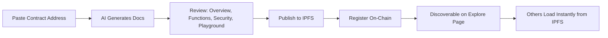

# ChainLens: Problem, Solution & Impact

AI-Powered Smart Contract Documentation for BNB Chain

---

## 1. Problem

- **Undocumented smart contracts are the norm.** The vast majority of deployed contracts on BNB Chain have zero documentation. Developers, auditors, and users must read raw Solidity to understand what a contract does, how it works, and whether it's safe.

- **Who is affected:**
  - **Developers** integrating with third-party contracts waste hours reverse-engineering function signatures, parameters, and behavior.
  - **Auditors & security researchers** lack structured context when reviewing contracts, making vulnerability assessment slower and error-prone.
  - **End users & investors** have no accessible way to understand what a contract does before interacting with it, increasing exposure to scams and exploits.

- **Why it matters:** Undocumented contracts create friction at every layer, slower development, missed vulnerabilities, and reduced user confidence. There is no standardized, on-chain system for contract documentation on BNB Chain today.

---

## 2. Solution

ChainLens generates comprehensive, AI-powered documentation for any verified smart contract on BNB Chain, and stores it permanently on IPFS with an on-chain registry for discoverability and verification.

**Key features:**
- **AI Documentation Engine**: Claude AI analyzes Solidity source code and generates structured documentation: executive summary, function reference, security analysis, state variables, events, and design patterns.
- **Interactive Playground**: Auto-generated UI for every contract function. Users can read state and execute write transactions directly in the browser without writing code.
- **On-Chain Registry**: Documentation metadata (IPFS hash, version, function count) is registered on the DocRegistry smart contract on BSC, creating a permanent, verifiable, and discoverable record.
- **Smart Caching**: Before generating new docs, ChainLens checks the on-chain registry. If documentation already exists, it loads instantly from IPFS, no AI call, no wait.
- **Contract Diffing**: AST-based comparison between contract versions detects structural changes, breaking modifications, and security implications.
- **Multi-Format Export**: Download documentation as Markdown, PDF, or HTML for offline use or integration into existing workflows.
- **Dependency Visualization**: Interactive graph showing cross-contract relationships, inheritance chains, and external dependencies.

**How it differs from alternatives:**
- Etherscan shows source code but provides no documentation, no security analysis, and no interactive testing.
- Manual documentation is expensive, rarely maintained, and not verifiable.
- ChainLens combines AI generation + permanent storage + on-chain proof + interactive playground in a single tool.

**User Journey:**

---

## 3. Business & Ecosystem Impact

- **Target users:**
  - Solidity developers building on BNB Chain who need to understand third-party contracts.
  - Security auditors who need structured contract analysis as a starting point.
  - DeFi users who want to verify what a contract does before interacting.
  - Project teams who want to document their own contracts for transparency.

- **Adoption path:**
  1. Developers discover ChainLens when they need to understand an undocumented contract.
  2. They generate and publish docs, contributing to the on-chain registry.
  3. The registry grows through community contributions, each documented contract makes the platform more valuable for the next user (network effect).
  4. Projects adopt ChainLens as their official documentation layer, linking to it from their repos and UIs.

- **Value to the BNB Chain ecosystem:**
  - Increases transparency and trust across the entire chain.
  - Lowers the barrier for developers to build on top of existing contracts.
  - Creates a permanent, decentralized knowledge base of contract documentation that grows over time.
  - The DocRegistry smart contract serves as a public good, zero publish fee, open to anyone.

- **Sustainability:**
  - Freemium model potential: free for public contracts, paid tiers for private analysis, batch generation, or API access.
  - The on-chain registry has an adjustable publish fee (currently 0) that can be activated for sustainability without changing the contract.

---

## 4. Limitations & Future Work

**Current limitations:**
- Documentation quality depends on contract source being verified on BSCScan. Unverified contracts cannot be documented.
- AI-generated content may occasionally misinterpret complex or unconventional Solidity patterns.
- Playground write functions require MetaMask, no support for other wallet providers yet.
- Documentation is English-only.

**Short-term roadmap (1-3 months):**
- WalletConnect integration for broader wallet support.
- Batch documentation generation for entire protocol suites.
- Documentation quality scoring and community ratings.
- Support for additional BNB Chain networks (opBNB documentation generation).

**Longer-term roadmap (3-6 months):**
- Multi-language documentation (auto-translate to Chinese, Korean, etc.).
- Tenderly simulation integration for playground, test write functions without spending gas.
- Documentation change alerts, notify users when a contract is upgraded and docs need updating.
- SDK/API for programmatic documentation generation, enabling CI/CD integration.
- Governance system for documentation disputes and corrections.

**Open questions:**
- What incentive mechanisms would best drive community documentation contributions?
- Should documentation versioning be tied to contract proxy upgrades automatically?
