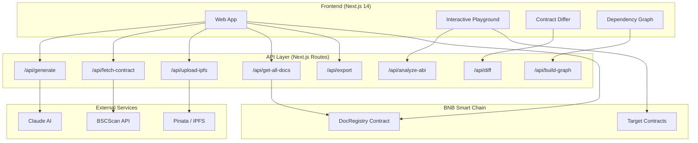
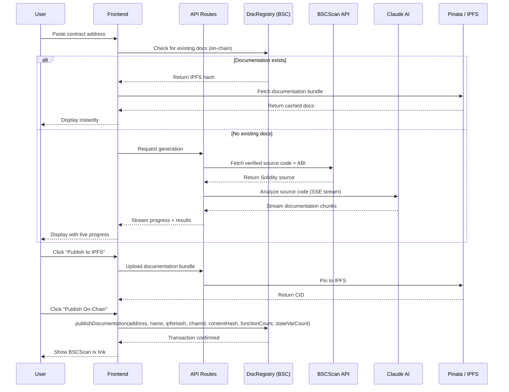
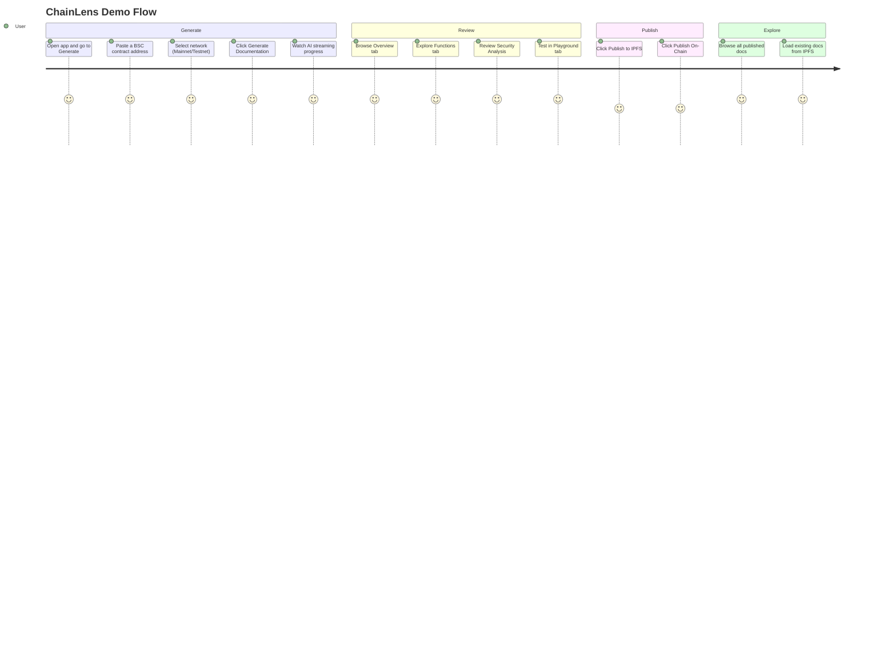

# Technical: Architecture, Setup & Demo

ChainLens — AI-Powered Smart Contract Documentation for BNB Chain

---

## 1. Architecture

### System Overview

ChainLens is an app that combines AI analysis, decentralized storage, and on-chain registry to generate, store, and serve smart contract documentation. The system operates with three layers: a Next.js frontend/API layer, external services (Claude AI, BSCScan, IPFS/Pinata), and on-chain smart contracts (DocRegistry on BSC).

### Components

| Component | Technology | Role |
|-----------|-----------|------|
| **Frontend** | Next.js 14 (App Router), Tailwind CSS, Shadcn UI | User interface: doc generation, playground, diffing, dependency graph, explore page |
| **API Layer** | Next.js API Routes (serverless) | Orchestrates AI calls, BSCScan fetching, IPFS uploads, ABI analysis, contract diffing |
| **AI Engine** | Claude API (`@anthropic-ai/sdk`) | Analyzes Solidity source code and generates structured documentation with security analysis |
| **AST Parser** | `@solidity-parser/parser` | Parses Solidity into AST for diffing, dependency mapping, and structural analysis |
| **Web3 Layer** | ethers.js v6, MetaMask | Read/write contract interaction in the playground, wallet connection, network switching |
| **Storage** | Pinata (IPFS) | Permanent, decentralized storage of documentation bundles |
| **On-Chain Registry** | DocRegistry (Solidity 0.8.24, OpenZeppelin) | Stores documentation metadata (IPFS hash, version, content hash) on BSC for discoverability |
| **Visualization** | React Flow, D3.js, Recharts | Dependency graphs, contract relationship mapping |

### Component Diagram



### Data Flow



### On-Chain vs Off-Chain

| Layer | What it handles |
|-------|----------------|
| **On-chain (DocRegistry)** | Documentation metadata: contract address, IPFS hash, content hash (SHA-256), version number, function count, state variable count, generator address, timestamp. Enables discoverability, verification, and version history. |
| **Off-chain (IPFS)** | Full documentation bundle: executive summary, function docs, security analysis, ABI, source code snapshot. Stored permanently on IPFS via Pinata. |
| **Off-chain (API)** | AI generation (Claude API), source code fetching (BSCScan API), AST parsing, contract diffing, dependency mapping, export generation. All stateless serverless functions. |
| **Client-side** | Playground read calls (direct RPC via ethers.js), write transactions (MetaMask signer), wallet state management, UI rendering. |

### Security Considerations

- **API keys** are server-side only (`ANTHROPIC_API_KEY`) or client-prefixed (`NEXT_PUBLIC_BSCSCAN_API_KEY`) following Next.js conventions.
- **DocRegistry** uses OpenZeppelin's `ReentrancyGuard`, `Ownable`, and `Pausable` for contract security.
- **Content hash verification**: SHA-256 hash of documentation is stored on-chain, allowing anyone to verify IPFS content hasn't been tampered with.
- **Playground write functions** require explicit MetaMask approval for every transaction — no private keys are stored or transmitted.
- **Read-only calls** use public RPC endpoints with `staticNetwork: true` to avoid unnecessary network detection requests.

---

## 2. Setup & Run

### Prerequisites

- **Node.js 18+** and npm
- **MetaMask** browser extension (for playground write functions and on-chain publishing)
- **API Keys:**
  - [Anthropic API key](https://console.anthropic.com/) — for Claude AI documentation generation
  - [BSCScan API key](https://bscscan.com/apis) — for fetching verified contract source code
  - [Pinata JWT](https://app.pinata.cloud/) — for IPFS uploads (optional, only needed for publishing)

### Environment Variables

Create a `.env` file from the example:

```bash
cp .env.example .env
```

| Variable | Description | Required |
|----------|------------|----------|
| `ANTHROPIC_API_KEY` | Claude AI API key (server-side only) | Yes |
| `NEXT_PUBLIC_BSCSCAN_API_KEY` | BSCScan API key | Yes |
| `NEXT_PUBLIC_PINATA_JWT` | Pinata IPFS JWT token | For publishing |
| `NEXT_PUBLIC_CONTRACT_ADDRESS_MAINNET` | DocRegistry on BSC Mainnet (`0x94e7DAaeB4d28fF2e71912fd06818b41009de47e`) | For on-chain features |
| `NEXT_PUBLIC_CONTRACT_ADDRESS_TESTNET` | DocRegistry on BSC Testnet (`0x94e7DAaeB4d28fF2e71912fd06818b41009de47e`) | For on-chain features |

### Install & Build

```bash
# Clone the repository
git clone https://github.com/Giftea/chainlens.git
cd chainlens

# Install dependencies
npm install

# Development server
npm run dev
# Open http://localhost:3000

# Production build
npm run build
npm start
```

### Smart Contract Development (optional)

```bash
# Compile contracts
npx hardhat compile

# Run contract tests
npx hardhat test

# Deploy to BSC Testnet
npx hardhat run src/contracts/deploy.ts --network bscTestnet

# Deploy to BSC Mainnet
npx hardhat run src/contracts/deploy.ts --network bscMainnet
```

### Verify Setup

1. Open `http://localhost:3000` — landing page loads.
2. Navigate to `/generate` — paste any verified BSC contract address (e.g., `0x55d398326f99059fF775485246999027B3197955` for BSC-USD).
3. Click "Generate Documentation" — streaming progress should appear, followed by full documentation.
4. Navigate to `/explore` — on-chain published docs should load (requires `NEXT_PUBLIC_CONTRACT_ADDRESS_MAINNET` to be set).

### Deployed Contracts

| Network | Address | Explorer |
|---------|---------|----------|
| BSC Mainnet | `0x94e7DAaeB4d28fF2e71912fd06818b41009de47e` | [BSCScan](https://bscscan.com/address/0x94e7DAaeB4d28fF2e71912fd06818b41009de47e) |
| BSC Testnet | `0x94e7DAaeB4d28fF2e71912fd06818b41009de47e` | [BSCScan Testnet](https://testnet.bscscan.com/address/0x94e7DAaeB4d28fF2e71912fd06818b41009de47e) |

---

## 3. Demo Guide

### Access

- **Live app**: [https://chainlens-bcs.vercel.app/](https://chainlens-bcs.vercel.app/)
- **Local**: `npm run dev` then open `http://localhost:3000`

### User Flow



### Key Actions to Try

**1. Generate Documentation**
- Go to `/generate`
- Paste a verified BSC contract address (try `0x55d398326f99059fF775485246999027B3197955` — BSC-USD/USDT on mainnet)
- Select "BSC Mainnet" as the network
- Click "Generate Documentation"
- Expected: Streaming progress bar appears, then full documentation loads with tabs for Overview, Functions, Security, Events, State Variables

**2. Interactive Playground**
- After generating docs, click the "Playground" tab
- Left panel shows all contract functions grouped by Read / Write / Payable
- Click a read function (e.g., `name()`, `symbol()`, `totalSupply()`)
- Click "Execute" — result displays inline with type-aware formatting
- For functions with parameters (e.g., `balanceOf(address)`), fill in the input field and execute
- Expected: Read functions return results instantly via public RPC. Write functions prompt MetaMask connection.

**3. Contract Diffing**
- Go to `/diff`
- Paste source code of two contract versions
- Click "Compare"
- Expected: Side-by-side diff showing added/removed/modified functions, state variables, and breaking changes with security implications

**4. Dependency Graph**
- After generating docs, view the "Dependencies" tab
- Expected: Interactive React Flow graph showing contract inheritance, external calls, and cross-contract relationships. Nodes are draggable.

**5. Export Documentation**
- After generating docs, click the export button
- Choose format: Markdown, PDF, or HTML
- Expected: File downloads with full documentation in the selected format

**6. Publish to IPFS & On-Chain**
- After generating docs, click "Publish to IPFS" — uploads the documentation bundle to IPFS via Pinata
- Then click "Publish On-Chain" — calls `publishDocumentation()` on the DocRegistry contract (requires MetaMask + BNB for gas)
- Expected: Documentation is permanently stored and discoverable by other users

**7. Explore Published Docs**
- Go to `/explore`
- Browse all on-chain published documentation
- Click any entry to load docs instantly from IPFS (no AI regeneration needed)
- Expected: Previously published docs load in seconds from IPFS cache

### Expected Outcomes

| Action | Expected Result |
|--------|----------------|
| Generate docs | Streaming progress, then full documentation with 6+ tabs |
| Read function in playground | Instant result with type-aware formatting (addresses link to BSCScan, uint256 shows wei + ether) |
| Write function in playground | MetaMask popup for transaction approval, then tx hash with BSCScan link |
| Publish to IPFS | CID returned, documentation permanently stored |
| Publish on-chain | MetaMask tx, then docs appear on Explore page |
| Load cached docs | Instant load from IPFS, no AI call |
| Contract diff | Structural comparison with breaking change detection |

### Troubleshooting

| Issue | Cause | Fix |
|-------|-------|-----|
| "Failed to fetch contract" | Contract not verified on BSCScan | Use a verified contract address. Check on BSCScan that the "Contract" tab shows source code. |
| "Failed to fetch" on playground read | RPC CORS issue or wrong network | Ensure the selected network matches the contract's actual network. |
| Playground write functions not working | MetaMask not connected or wrong network | Click "Connect Wallet" and switch MetaMask to BSC Mainnet (Chain ID 56) or Testnet (Chain ID 97). |
| "Insufficient funds" on publish | Not enough BNB for gas | Fund your wallet with BNB. Publishing costs ~0.001 BNB in gas. The publish fee itself is 0. |
| Docs not loading on Explore page | `NEXT_PUBLIC_CONTRACT_ADDRESS_MAINNET` not set | Add `NEXT_PUBLIC_CONTRACT_ADDRESS_MAINNET=0x94e7DAaeB4d28fF2e71912fd06818b41009de47e` to `.env` and restart the dev server. |
| AI generation fails | Missing or invalid Anthropic API key | Check that `ANTHROPIC_API_KEY` is set correctly in `.env` (server-side, no `NEXT_PUBLIC_` prefix). |
| IPFS upload fails | Missing Pinata JWT | Add `NEXT_PUBLIC_PINATA_JWT` to `.env` with your Pinata API token. |
